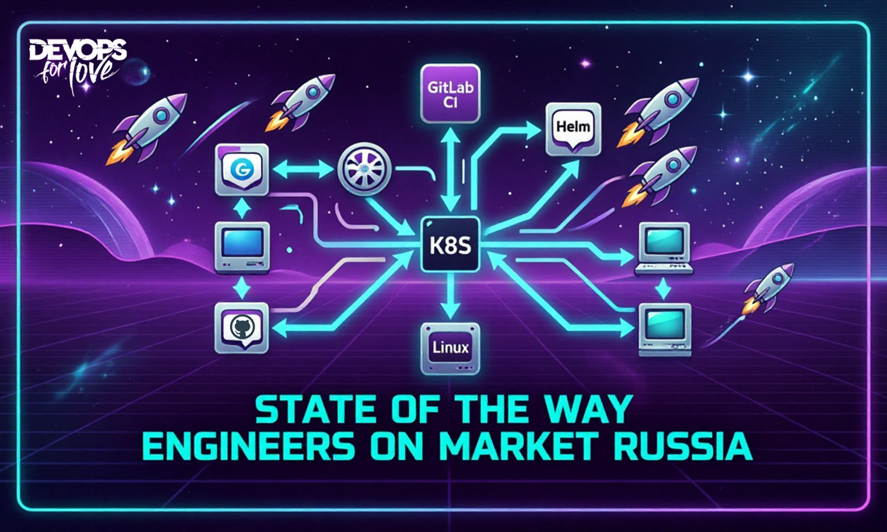

# State of the Way Engineers on market Russia
1 в РФ исследование пути найма инженера (DevOps, Ops, Cloud, SRE и т.д.) на рышке

В данном репозитории описан список вопросов для CustDev, которые могут быть использованы, как в рамках одной организации, так и применимы для отдельной взятой отрасли.
Обращу внимание, что тут будут только вопросы, результаты самого исследования, презентация и видеоматериалы будут
представлены после презентации исследования 13/10/2026 на конференции DevOops 2026 
https://devoops.ru/talks/20011116-the-devops-engineer-s-social-contract/

## Вопросы для CustDev внутри компании ##
1. Насколько соответствуют описания ваших инженерных вакансий и задач в них и реальные задачи после трудоустройства?
2. Вы делайте зонтичные вакансии или точечные?
3. Светите ли вы зарплатную вилку или обсуждаете ожидания на первом этапе обсуждения с HR?
3. Сколько у вас этапов собеседования?
4. Насколько у вас выстроен процесс найма инженеров с руководителями подразделений? Этот путь единообразен или периодически случаются отхождения от процесса?
5. Сколько времени занимает процесс от создания вакансии инженера до фактического найма?
6. Сколько времени занимает у руководителей составление описание вакансии?
7. Какой % релевантных резюме поступает от рекрутёра к руководителю, по которым он говорит “ок” для следующего этапа? Сколько итераций требуется, чтобы положительный процент был более 80%?
8. Есть ли у вас технические задачи на собеседованиях? Насколько они реальны и применимы к задачам на рабочем месте? Как часто они актуализируются?
9. По каким причинам кандидат может не выбрать вашу компанию? Руководителя, куда он нанимается?
10. Какие есть 3-5 "Red flags" у нанимающего руководителя к себе в команду по отношению к кандидатам?
11. Чем ваша вакансия лучше, чем другие на рынке?
12. Что вы можете предложить, помимо стандартного соц. пакета и ДМС? (оплата обучения, спорт, конференции и т.д.)
13. Чем кандидат "платит" за такие *плюшки?
14. Есть ли в вашей компании культурные и отраслевые особенности, из-за которых кандидат может не подойти? Проговаривайте ли вы их на собеседованиях или эта информация становится доступна только после найма?
15. Готовы ли вы ответить на вопрос - по какой причине чаще всего уходят инженеры из вашей компании или подразделения, куда идёт найм?
16. Есть ли в вашей компании автоматизированный процесс онбординга? (Например, бот в мессенджере, который помогает пройти весь путь и отвечает на вопросы)
17. Есть ли в вашей компании фиксированный и единообразный процесс онбординга? Если нет, то в чём разница между подразделениями?
18. При выходе на работу через какой период времени сотрудник получает готовое рабочее место и доступы, необходимые для начала выполнения своих задач?
19. Какое количество задач на испытательный срок вы даёте сотруднику?
20. Как и кем проверяется выполнение задач?
21. Есть ли у сотрудника закреплённый ментор или куратор на период испытательного срока?
22. Собирайте ли вы обратную связь с коллег, которые взаимодействую с сотрудником во время испытательного срока?
23. Делайте ли вы промежуточное ревью по статусам выполнения задач на испытательный срок, например, посередине срока?
24. Внедрены ли в компании матрицы компетенций? Они живут только в командах или внедрены в процесс пересмотра заработной платы?
25. За что в компании отвечает инженер? Какие виды инженеров есть в компании и каковы у них зоны ответственности?
26. Есть ли в компании процессы внутреннего аудита процессов разработки?
27. Внедрён ли в вашей компании технологический радар? Кто следит за его соблюдением и какие последствия за неисполнения?
28. Допустима ли в компании публичная деятельность или на это наложено табу?
29. Принимают ли ваша компания участия в отраслевых конференциях, исследованиях?
30. Есть ли в компании процесс обучения и повышения квалификации?
31. Есть ли в вашей компании комьюнити, гильдии, сообщества по интересам?

ЗЫ: вы так же можете предлогать свои вопросы или разделение их на блоки.

Более подробно механика исследования и его результаты будут описаны позднее.

Copyright (c) Krylov Aleksandr.

License autor by Krylov Aleksandr type cc.

Permission is hereby granted, free of charge, to any person obtaining a copy of this software and associated documentation files (the "Software"), to deal in the Software without restriction, including without limitation the rights to use, copy, modify, merge, publish, distribute, sublicense, and/or sell copies of the Software, and to permit persons to whom the Software is furnished to do so, subject to the following conditions:

The above copyright notice and this permission notice shall be included in all copies or substantial portions of the Software.

THE SOFTWARE IS PROVIDED "AS IS", WITHOUT WARRANTY OF ANY KIND, EXPRESS OR IMPLIED, INCLUDING BUT NOT LIMITED TO THE WARRANTIES OF MERCHANTABILITY, FITNESS FOR A PARTICULAR PURPOSE AND NONINFRINGEMENT. IN NO EVENT SHALL THE AUTHORS OR COPYRIGHT HOLDERS BE LIABLE FOR ANY CLAIM, DAMAGES OR OTHER LIABILITY, WHETHER IN AN ACTION OF CONTRACT, TORT OR OTHERWISE, ARISING FROM, OUT OF OR IN CONNECTION WITH THE SOFTWARE OR THE USE OR OTHER DEALINGS IN THE SOFTWARE.