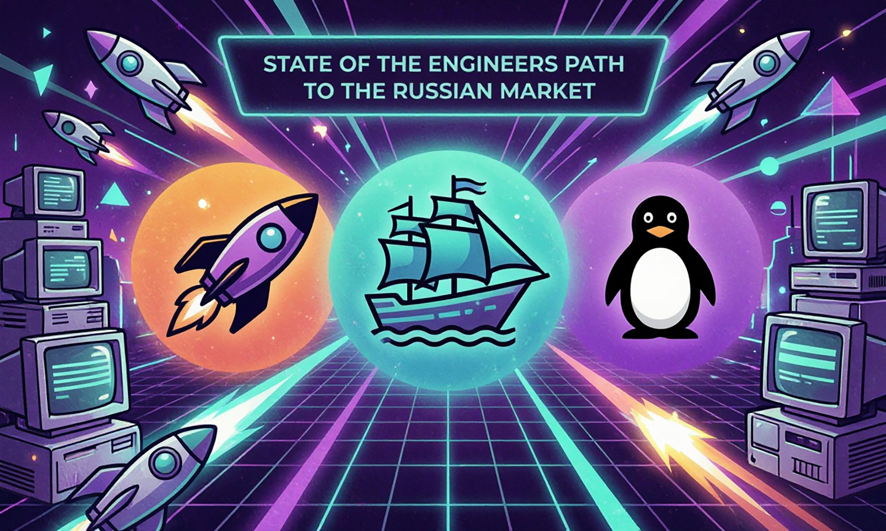

# State of the Engineers' path to the Russian market
Первое в РФ исследование пути найма инженера (DevOps, Ops, Cloud, SRE и т.д.) на рынке

В данном репозитории описан список вопросов для CustDev, которые могут быть использованы, как в рамках одной организации, так и применимы для отдельной взятой отрасли.
Обращу внимание, что тут будут только вопросы, результаты самого исследования, презентация и видеоматериалы будут
представлены после презентации исследования 13/10/2026 на конференции DevOops 2026 
https://devoops.ru/talks/20011116-the-devops-engineer-s-social-contract/

## Вопросы для CustDev внутри компании ##

[questions.md](questions.md)



# devops-social-contract

Презентация «Социальный контракт между DevOps-инженером и работодателем» по исследованию «State of the Engineer's Path to the Russian Market». Доклад Александра Крылова, технического директора ИТ Школы Ростелекома.

Собрана на [Slidev](https://sli.dev). Исходником был PowerPoint-дек `…_v2.pptx`: каждый слайд перенесён кадром 1920×1080, заметки спикера перенесены текстом, анимации по клику — отдельными кадрами.

## Публикация на GitHub Pages

1. Создайте репозиторий и залейте в ветку `main` содержимое этой папки.
2. В настройках репозитория: Settings → Pages → Source → **GitHub Actions**.
3. Дальше всё делают пайплайны из `.github/workflows/`.

Слайды откроются по адресу `https://<user>.github.io/<repo>/`.

## CI/CD

- `ci.yaml` — на каждый pull request и push в любую ветку, кроме `main`: ставит зависимости, проверяет, что все кадры из `pages/` есть в `public/slides/`, собирает дек и прикладывает `dist` артефактом на 7 дней.
- `deploy.yaml` — на push в `main` и вручную: собирает дек и выкладывает на GitHub Pages. Базовый путь берётся из настроек Pages, поэтому работает и с `user.github.io/repo/`, и со своим доменом.
- `export-pdf.yaml` — вручную или по тегу `v*`: собирает PDF со всеми шагами анимации. По тегу PDF прикладывается к релизу.
- `dependabot.yml` — раз в неделю обновляет npm-зависимости и версии actions.

Пока в репозитории нет `package-lock.json`, пайплайны ставят зависимости через `npm install`; как только lock-файл закоммичен, они сами переходят на `npm ci`.

## Структура

`slides.md` — точка входа: headmatter, титульный слайд и порядок остальных слайдов через `src:`. Всё, кроме титула, лежит по одному слайду в файле в `pages/NN-блок/`:

- `pages/00-intro/` — вступление: идеальная компания, спикер, исследование;
- `pages/01-market/` — рынок инженеров: оптимизации, дисбаланс зарплат, кризис конференций, псевдовакансии;
- `pages/02-methodology/` — методология: участники, интервью, классификатор, чек-лист;
- `pages/03-search/` — поиск и вакансии: типы вакансий, вилка, фильтры, тестовые;
- `pages/04-culture/` — условия и культура: оффер, soft vs hard, red flags, плюшки, зарплаты;
- `pages/05-onboarding/` — адаптация и процессы: онбординг, руководители, обучение;
- `pages/06-tech/` — технологии и развитие: зоны ответственности, пересмотр ЗП, стеки;
- `pages/07-outro/` — итоги и контакты.

Файл страницы называется `MM-слаг.md`, где `MM` — позиция слайда в блоке. Блоки 02–06 открываются разделителем `00-section.md`. Frontmatter слайда живёт в файле страницы, в `slides.md` остаётся только `src:`.

## Как устроен слайд

```md
---
layout: shot
routeAlias: salary-gap
title: "Дисбаланс по зарплатам"
clicks: 4
---

<Shot src="slides/010-0.webp" alt="Дисбаланс по зарплатам" />
<Shot v-click src="slides/010-1.webp" alt="" />

<!--
Заметка спикера
-->
```

- `layouts/shot.vue` — лейаут без полей, `components/Shot.vue` — кадр на весь холст из `public/slides/`.
- Первый `<Shot>` виден сразу, каждый следующий с `v-click` ложится поверх по клику. Так перенесены анимации исходного дека: кадр `NNN-0` — состояние до первого клика, последний — слайд целиком.
- Последний HTML-комментарий в файле — заметка спикера, она видна в режиме докладчика (`/presenter`).

Рукописные пометки поверх графика на слайде `top25` в кадры не попали: они есть только в PowerPoint-версии.

## Адреса слайдов

У каждого слайда есть `routeAlias`, поэтому в адресе имя, а не номер: `#/speaker`, `#/red-flags-1`, `#/thanks`. Алиас совпадает со слагом файла, у разделителей — `<блок>-section`. Роутер работает в hash-режиме, чтобы прямые ссылки открывались на GitHub Pages.

## Как поменять слайд

Текст и графика слайда запечены в картинку. Чтобы изменить слайд, поправьте его в PowerPoint, экспортируйте в PNG/WebP 1920×1080 и замените файл в `public/slides/` под тем же именем. Заметки правятся прямо в `pages/…/*.md`.

## Ссылки со слайдов

Ссылки на картинках не кликаются, поэтому собраны здесь:

- Топ-25 ИТ-профессий и медианы зарплат по площадкам: <https://habr.com/ru/articles/1069376/>
- Отчёт о зарплатах DevOps, апрель 2026: <https://checkroi.ru/blog/zarplata-devops-inzhener/>
- Обзор ИИ-фильтров и ATS: <https://t-j.ru/proiti-ats-filtri/>
- Доклад о корпоративной культуре: <https://www.youtube.com/watch?v=txmyk65LYa4>
- «Трансформация конференций»: <https://www.youtube.com/watch?v=x9Ge5zdYhNE>
- Этапы появления площадки обучения: <https://www.youtube.com/watch?v=ANDFe1GATOU>
- Каналы: [@itschoolrtk](https://t.me/itschoolrtk), [@devopsforlove](https://t.me/devopsforlove), [@kuber_community](https://t.me/kuber_community)

## Useful

Все цели — в `make help`.

```
make dev      # dev-сервер
make build    # статический сайт в dist/
make export   # PDF со всеми шагами
```

`package-lock.json` в архив не входит: выполните `npm install` один раз и закоммитьте его, чтобы сборки были воспроизводимыми.


Copyright (c) Krylov Aleksandr.

License autor by Krylov Aleksandr type cc.

Permission is hereby granted, free of charge, to any person obtaining a copy of this software and associated documentation files (the "Software"), to deal in the Software without restriction, including without limitation the rights to use, copy, modify, merge, publish, distribute, sublicense, and/or sell copies of the Software, and to permit persons to whom the Software is furnished to do so, subject to the following conditions:

The above copyright notice and this permission notice shall be included in all copies or substantial portions of the Software.

THE SOFTWARE IS PROVIDED "AS IS", WITHOUT WARRANTY OF ANY KIND, EXPRESS OR IMPLIED, INCLUDING BUT NOT LIMITED TO THE WARRANTIES OF MERCHANTABILITY, FITNESS FOR A PARTICULAR PURPOSE AND NONINFRINGEMENT. IN NO EVENT SHALL THE AUTHORS OR COPYRIGHT HOLDERS BE LIABLE FOR ANY CLAIM, DAMAGES OR OTHER LIABILITY, WHETHER IN AN ACTION OF CONTRACT, TORT OR OTHERWISE, ARISING FROM, OUT OF OR IN CONNECTION WITH THE SOFTWARE OR THE USE OR OTHER DEALINGS IN THE SOFTWARE.